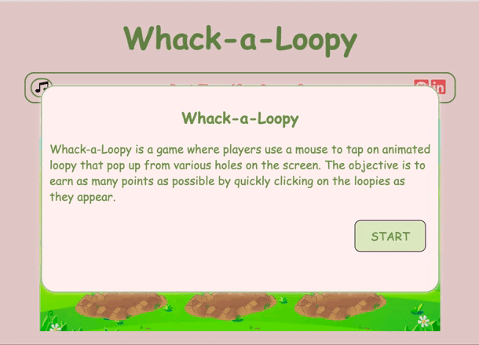
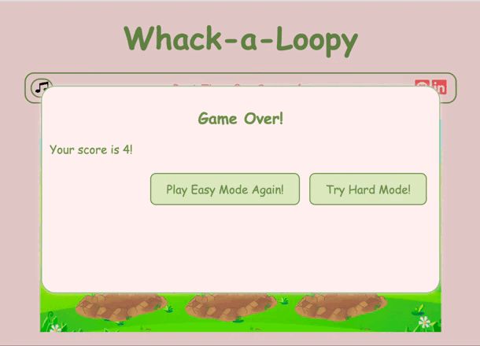
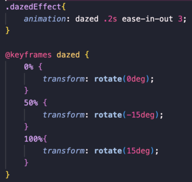

  

## Whack-a-Loopy

"Whack-a-Loopy" is a fun twist on the classic "Whack-a-Mole" game, which is a popular arcade game that was invented in the early 1970s. It is very simple, but highly entertaining, and as a result, it has been loved by people of all ages for decades. The game follows these rules:

- In the game, you'll find a game surface that resembles a farm, complete with multiple holes. Loopies will unpredictably pop up from these holes.

- Players have control over a mallet, and their objective is to strike the moles as they pop up, earning points for each successful hit.

- The player's goal is to attain a higher score within a designated time frame.

- After the time is up, user can see their scores and they are then given the option to continue playing in a simple mode or try a harder mode.

##  Live Site
[Whack-a-Loopy](elevenstand7.github.io/JSProject)

## Technologies, Libraries, APIs

This project is a vanilla JavaScript project that is implemented with the following technologies:

*   DOM Manipulation to handle events, update scores and time, instantiate an audio object, control music state, and manage game states
*   Npm to manage project dependencies
*   Webpack to bundle the source JavaScript code

##  Features

* Game introduction pop-up window when users open the web page and difficulty selection pop-up window when the user finished the easy mode game; The challenge that I faced when I wanted to implement this feature was that I did a lot of research but I couldn't find the best method to achieve it, like the CSS and JavaScrip combination popups and Modal Box. They have similar functionality but not the outcome I want. Then after a lot of research, I tried to use the dialog element in HTML, it's new and it can do what I want.

-   Game introduction pop-up window:

  

* Once the game starts, Loopies will pop up from the holes. When the user hits the Loopy, it will have a dazed effect and sound. The challenge that I faced was I wanted to use the Animation API at the beginning, but when I read the documents, I figured out that the animation property in CSS was fair enough for my game animation. It's simpler and easy to adjust.

-   The hard mode of the game:

  

- The CSS code to achieve a dazed effect:

  

* The game interface has a countdown timer, a score display, a mute/unmute button for the background music, and some navigation links to this project's GitHub repository and my LinkedIn profile. When the user's cursor enters the farm picture, it will become a mallet.

##  Future Features

- add animation to the mallet
- increase the number of holes, and add moving holes in the hard mode

