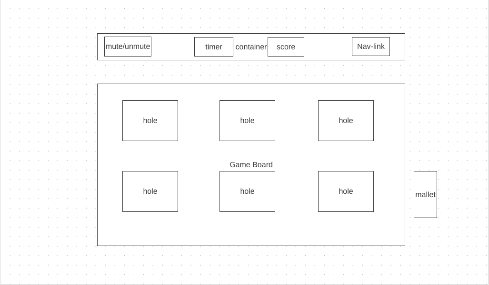

## Background

"Whack-a-Loopy" is a Whack-a-Mole" like game, which is a popular arcade game that was invented in the early 1970s. It is very simple, but highly entertaining, and as a result, it has been loved by people of all ages for decades. The game follows these rules:

- In the game, you'll find a game surface that resembles a farm, complete with multiple holes. Loopies will unpredictably emerge from these holes.

- Players have control over a mallet, and their objective is to strike the moles as they pop up, earning points for each successful hit.

- The player's goal is to attain a higher score within a designated time frame.

## Functionality & MVPs

With this Whack-a-Loopy Game, users will be able to:

* See a game introduction pop-up when user open the web page;
* Click "start",  user can close the intro page and enter the game;
* Has a countdown timer, a score display and mute/unmute for the background music;
* Has hard mode selection when user finished the easy mode;

In addition, this project will include:
* A production README
* An About module to describe the background and rules of the game

## Wireframes

*   Before the user begins playing the game, a popup window will appear, providing a game introduction and a start button to user.

*   Game container will include a music mute/unmute button, timer, score display and Navigation links. Navigation links will include direct links to this project's Github repository and my LinkedIn profile.

*   Game board will have holes and the loopy will pop up form the hole. The cursor will be a mallet.

## Technologies, Libraries, APIs

This project will be implemented with the following technologies:

*   DOM Manipulation to handle events, update scores, and manage game states
*   npm to manage project dependencies
*   Webpack to bundle the source JavaScript code
*   Animation to the animation of the game
*   Audio API to the background music

## Implementation Timeline

*   **Thursday:** Set up the project, including getting webpack up and running. Let the canvas display on the screen, and create the HTML structure for the game, including the game board and buttons. Begin styling with basic CSS to make the game visually presentable.

*   **Friday & Weekend:** Implement the game logic, ensure that I can create moles that pop up randomly, add event listeners for user interactions, create a simple scoring system and a countdown timer for the game.,

*   **Monday:** Debug and test the game's core functionality. Enhance the game's styling with CSS to make it visually appealing.

*   **Tuesday:** If my previous feature functions well, add the basic sound effects (e.g., background music and mole popping sound).

*   **Wednesday Morning:** Deploy to GitHub pages. If time, rewrite this proposal as a production README.

## Bonus features
*   Add difficulty level selection(In hard mode, there will be evil loopy that once hit will end the game.)
*   Add audio feature

